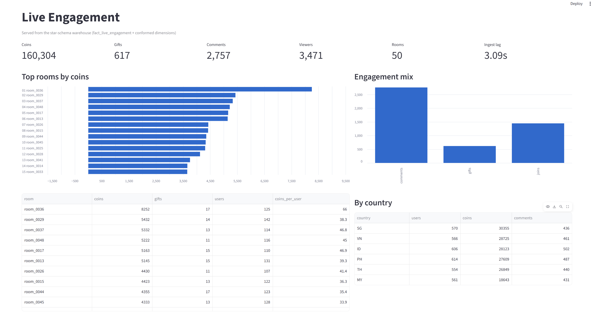
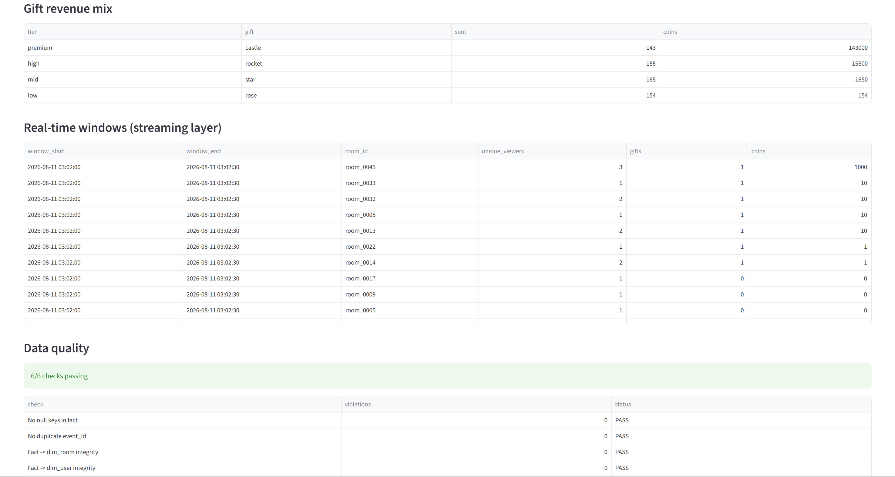

# Live-Streaming Data Warehouse (batch + real-time)

An end-to-end data pipeline for live-streaming engagement events: a Kafka to
**Spark Structured Streaming** real-time layer, an **offline star-schema warehouse**,
**data quality checks** that gate the load, and a **BI dashboard** served from the model.

```
   producer.py            Kafka              Spark Structured Streaming
  (join/comment/  ---->  (Redpanda)  ---->   * watermark (late events)
   gift/leave)                               * tumbling windows
                                                    |
                          +-------------------------+-------------------------+
                          |                                                   |
                  data/lake/events                                data/lake/room_metrics
                    (raw, append)                                   (real-time serving)
                          |
                          v
                  DuckDB warehouse            dim_room ---+
                    star schema               dim_user ---+--> fact_live_engagement
                  + quality checks             dim_gift ---+
                          |                    dim_date ---+
                          v
                  dashboard.py (Streamlit BI)
```

## What each piece demonstrates

| File | Concern |
|---|---|
| `src/producer.py` | Event generation; deliberately emits ~3% **late events** |
| `src/streaming_job.py` | **Watermarking**, **tumbling-window** aggregation, dual sinks, checkpointing |
| `sql/warehouse.sql` | **Dimensional modeling**: conformed dimensions, declared fact grain |
| `src/warehouse.py` | **Data quality gates**: referential integrity, dedupe, reconciliation |
| `src/dashboard.py` | **BI serving layer**: Streamlit dashboard, every tile a SQL query on the star schema |

## Run it

```bash
pip install -r requirements.txt
```

**Local (no broker needed).** The file source stands in for Kafka:

```bash
python -m src.producer --sink file --rate 300 --seconds 20 --outdir data/raw
python -m src.streaming_job --source file --indir data/raw --seconds 100
python -m src.warehouse --lake data/lake/events --db data/warehouse.duckdb
streamlit run src/dashboard.py
```

**With Kafka:**

```bash
docker compose up -d
python -m src.producer --sink kafka --rate 300 --seconds 60
python -m src.streaming_job --source kafka --bootstrap localhost:9092 --seconds 120
python -m src.warehouse
streamlit run src/dashboard.py
```

## Dashboard





The BI layer reads only from the warehouse, so business logic lives in one place:

- Headline metrics: coins, gifts, comments, viewers, rooms, ingest lag
- Top rooms by coins, with coins-per-user
- Engagement mix (joins / comments / gifts) and revenue mix by gift tier
- Country breakdown from the user dimension
- Latest real-time windows read straight from the streaming sink
- Data quality panel surfacing the same six assertions the batch load enforces

## OLAP serving layer

The DuckDB star schema is the modelling layer. ClickHouse is the serving layer:
the same facts laid out for fast slice-and-dice, plus a pre-aggregated rollup
that dashboards read instead of scanning the detail.

```bash
docker compose up -d clickhouse
python -m src.olap_load --server localhost
```

| Feature | Why it is there |
|---|---|
| `MergeTree` with `ORDER BY (event_date, room_id, user_id)` | Sorting key, so queries filtering a prefix skip granules instead of scanning |
| `PARTITION BY toYYYYMM(event_date)` | Whole partitions pruned when the query filters on date |
| `LowCardinality(String)` | Dictionary encoding for repeated values like room, country, gift tier |
| `AggregatingMergeTree` + materialized view | Rollup maintained on insert, so there is no scheduled job and no stale window |
| `uniqState` / `uniqMerge` | HyperLogLog, so distinct user counts stay cheap at scale |

Verified run on 5,936 fact rows against ClickHouse 24.8:

```
partitions on disk:  202608   5936 rows   55.80 KiB

Revenue by gift tier                     51 ms
Top rooms by coins                       63 ms
Country breakdown                        55 ms
Daily rollup from the materialized view  59 ms
Running total per room (window)          54 ms
```

The rollup returns the same numbers as the equivalent query against the detail
table, which is the check that matters: a pre-aggregation nobody trusts gets
bypassed.

## Governance: lineage, impact analysis, catalog

`src/lineage.py` parses `sql/warehouse.sql` with **sqlglot** and derives the
governance layer from the code itself, so it cannot drift:

| Feature | Why it is there |
| --- | --- |
| **Column-level lineage** | `fact_live_engagement.avg_ingest_lag_s` traces back to `stg_events.event_ts` and `stg_events.ingest_ts`, not just "depends on stg_events" |
| **Column-aware impact analysis** | `stg_events.coins` touches only `dim_gift` and `fact_live_engagement.coins`. Table-level lineage would flag all four dimensions and tell you nothing about what to re-test |
| **Catalog check** | Every table must declare owner, grain, freshness target and data classification; gaps are reported |

```
python -m src.lineage                   # full report
python -m src.lineage --column coins    # impact of one upstream column
```

```
if stg_events.coins changes:
  dim_gift              coin_value, gift_tier
  fact_live_engagement  coins

CATALOG GOVERNANCE CHECK
  [GAP ] dim_user   missing: classification
```

A hand-written lineage doc is wrong the moment someone edits a query.
A parsed one cannot drift.

## Verified output

```
model built:
  stg_events                    6,000 rows
  dim_date                          1 rows
  dim_room                         50 rows
  dim_user                      3,471 rows
  dim_gift                          5 rows
  fact_live_engagement          5,936 rows

data quality checks:
  [PASS] no null keys in fact
  [PASS] no duplicate event_id in staging
  [PASS] referential integrity: fact.room_key -> dim_room
  [PASS] referential integrity: fact.user_key -> dim_user
  [PASS] coins never negative
  [PASS] fact row count reconciles with staging

average ingest lag: 3.09s
ALL CHECKS PASSED
```

## Design notes

- **Why a watermark?** The producer emits events up to 90s late on purpose.
  A 20s watermark bounds streaming state while still admitting most late
  arrivals; anything later is dropped rather than growing state forever.
- **Fact grain** is one row per (date, room, user, gift) rollup, the lowest
  level the serving queries need, which keeps the fact table narrow without
  losing the ability to re-aggregate.
- **Append-mode windows** only emit once the watermark passes the window end,
  so the defaults (30s window / 20s watermark) are tuned for a short local run.
  Production values would be minutes.
- **Reconciliation check** (`SUM(fact.event_count) == COUNT(stg_events)`) is
  the one that catches real bugs, because a bad join silently drops or fans
  out rows.

## Next steps (to go deeper)

- Add an on-chain or CDC source; the streaming job takes it without changes.
- Swap DuckDB for a real warehouse engine and add incremental loads.
- Add adversarial quality checks (schema drift, late-arriving dimension keys).
